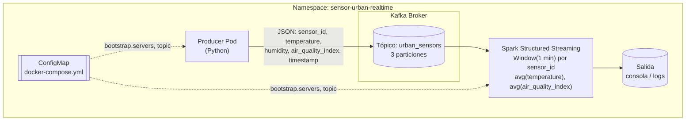
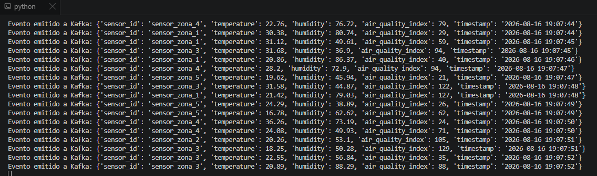
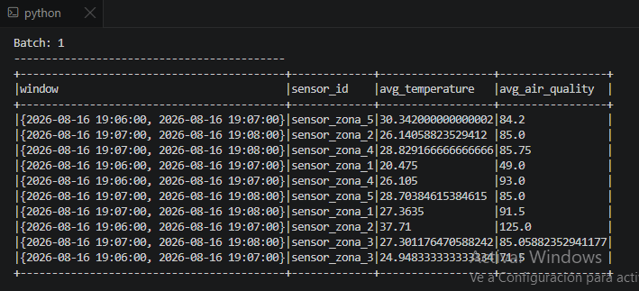
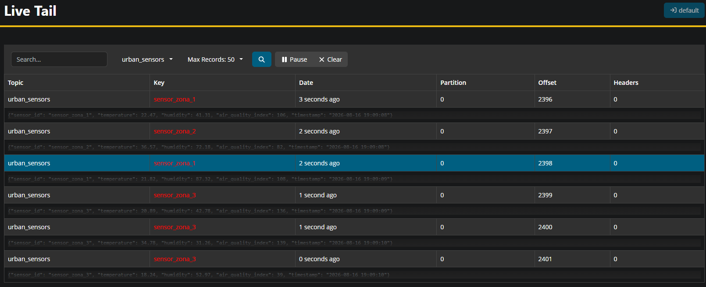

# Plataforma de Muestreo Urbano en Tiempo Real

Arquitectura completa de ingeniería de datos distribuida: **Kubernetes** como orquestador, **Apache Kafka** como bus de eventos, y **Apache Spark Structured Streaming** para procesar en tiempo real las métricas de sensores urbanos (temperatura, humedad y calidad del aire).

## Arquitectura



El productor simula sensores urbanos enviando lecturas cada pocos segundos al tópico de Kafka. Kafka particiona el tráfico por `sensor_id`, garantizando orden por sensor. 
Spark Structured Streaming lee el tópico de forma continua y calcula, en ventanas deslizantes de 1 minuto, el promedio de temperatura y calidad del aire por sensor.

## Estructura del repositorio

```
sensor-urban-realtime/
├── docker-compose.yaml
├── producer/
│   └── sensor_producer.py
├── spark/
│   └── spark_sensor_processor.py
└── README.md
```


## 1. Configuración del entorno


```bash
docker-compose up -d
```

## 2. Pipeline de ingesta (Kafka)

### Producer

`producer/sensor_producer.py` simula sensores urbanos enviando un JSON por evento con los campos:

```bash
python sensor_producer.py
```

```json
{
  "sensor_id": "sensor-03",
  "temperature": 21.4,
  "humidity": 58.2,
  "air_quality_index": 42.0,
  "timestamp": "2026-08-16T14:32:10Z"
}
```

Usa `sensor_id` como `PartitionKey`/key del mensaje, para que las lecturas de un mismo sensor mantengan orden dentro de la misma partición.

## 3. Procesamiento en tiempo real (Spark)

`spark/spark_sensor_processor.py` es un job de **Spark Structured Streaming** que:

1. Lee continuamente del tópico `urban_sensors` (`readStream` con el conector de Kafka).
2. Parsea el JSON de cada evento contra un `schema` explícito (`sensor_id`, `temperature`, `humidity`, `air_quality_index`, `timestamp`).
3. Aplica una ventana de tiempo (`window`) de **1 minuto** sobre `event_time`, agrupando por `sensor_id`.
4. Calcula `avg(temperature)` y `avg(air_quality_index)` por cada combinación de ventana + sensor.
5. Escribe el resultado a la salida configurada (consola en desarrollo; en producción normalmente sería otro tópico de Kafka, S3, o una tabla).

Se despliega como un Job de Kubernetes que corre el `spark-submit` dentro del cluster:

```bash
python spark_sensor_processor.py
```


## Verificación

Sensor Producer:



Spark Sensor Processor:



AKHQ localhost:8080




